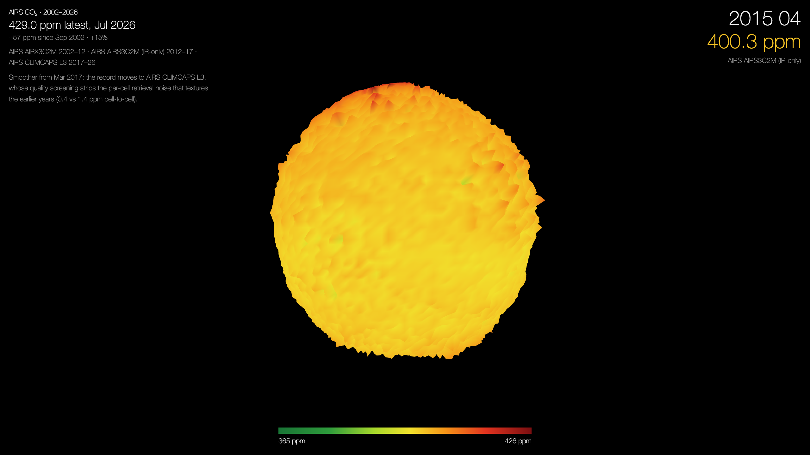
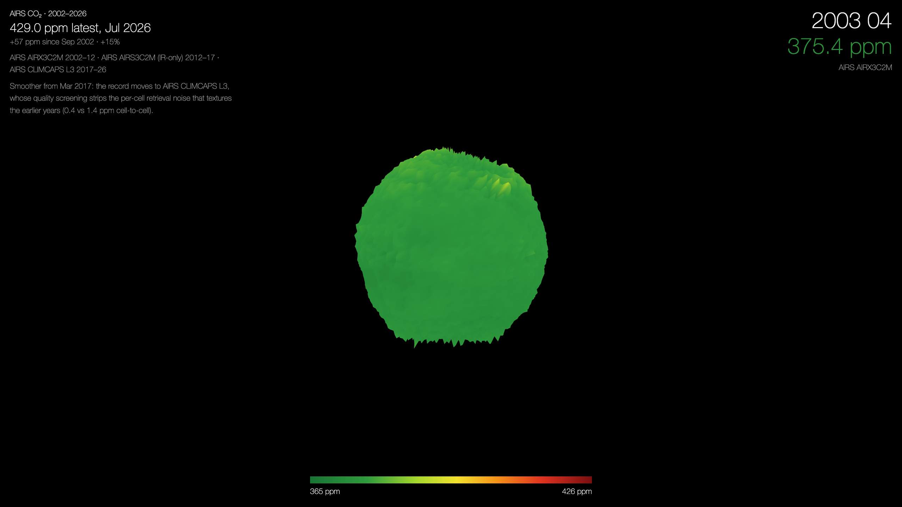
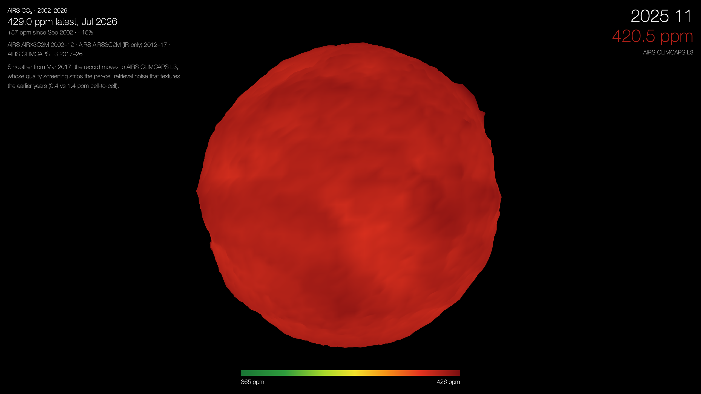

# Climate Globe

Twenty-three years of the atmosphere as a globe that swells and reddens: CO₂,
methane, carbon monoxide and near-surface temperature, month by month, all from
the same satellite.

Every cell of a 76 × 144 latitude/longitude grid is pushed out from the centre
in proportion to the value measured above it and coloured green through red, so
a month reads at once as a shape and as a temperature. Play the CO₂ layer and
the planet grows: **+57 ppm since 2002, +15%**.



It opens tilted 30° above the equator, looking down on the northern hemisphere
where nearly all the seasonal swing is. The globe turns on its own slow clock,
once every twelve seconds, while the months run past a year a second — two
independent rates, so the spin stays contemplative however fast the record is
read. Tap or click to stop it — the globe says so, under the layer tabs — and
twenty megacities fade in: HTML text, but projected through the same
matrix as the mesh and sitting at whatever radius their cell currently has,
fading out again as they cross the limb. On a phone-sized globe twenty names
would collide, so ten of them — spread through longitude, so every face carries
a few — keep their name and the rest keep just their dot.

**[▶ Open the live version](https://rokotyan.github.io/climate-globe/)**

## Two frames, twenty-two years apart

<!-- An HTML table with explicit 50% columns: a markdown table would size each
     column to its header text, leaving the two stills at different scales. -->
<table>
  <tr>
    <th width="50%">April 2003 — 375 ppm</th>
    <th width="50%">November 2025 — 421 ppm</th>
  </tr>
  <tr>
    <td></td>
    <td></td>
  </tr>
</table>

The globe is smaller and green early on and larger and red at the end because
both radius and colour follow the same value. Only a fraction of the climb
shows as growth, though: over 24 years CO₂'s mean moves far enough to swing the
radius three times as far as any other layer's, which left the globe opening at
under half its framed size. A separate gain holds the trend back to 0.4 without
touching the fur, which shares the same displacement scale.

The change in *surface texture*
is a different story — see [Why the texture fades](#why-the-texture-fades).

## Origins

This is a WebGL2 port of a Cinder/C++ piece from 2014, itself built on Robert
Hodgin's Cinder *Earthquake* sample. The port keeps the original's geometry and
feel exactly — the same grid and sphere mapping, the same
`radius = 200 + 5·(ppm − 375)` displacement, the same green→red HSV ramp, the
same auto-orbiting camera that follows the pointer without dragging, and the
same unlit shading (the original never enabled `GL_LIGHTING`; its smoothness
comes from Gouraud colour interpolation, not light).

What changed is where the work happens. The original re-interpolated the whole
grid and recomputed every normal on the CPU each frame. Here all 280 months
live in a single R32F texture atlas and the vertex shader interpolates between
two month slices, computing displacement and colour on the GPU — so a frame
costs one draw call and a handful of uniforms.

## Controls

Mouse keeps the original's passive feel — the camera follows the pointer, no
dragging:

| | |
| --- | --- |
| **pointer** | vertical position tilts the camera (to 80°), horizontal motion nudges the orbit |
| **wheel / ↑ ↓** | zoom |
| **click** | stop / start — and bring up the city labels |
| **← →** | previous / next layer |
| **.** | advance one month |
| **p** | stop / start (same as click) |
| **f** | fullscreen |
| **l** | faceted lighting on/off |
| **b** | bloom on/off |
| **1**–**4** | pick a layer directly (or use the tabs under the globe) |
| **h** | show the parameter panel |

Touch has no hover, so it gets the conventional mapping: **drag** to orbit,
**pinch** to zoom, **tap** to stop and start. Horizontal drag pushes the globe's
near face, so the surface under your finger travels the other way — which is
also the sense the pointer has always had on a mouse; the two used to disagree.

`h` opens an authoring panel for displacement, texture limit, base radius,
growth, lighting, rim light and falloff, bloom, the colour ramp, tilt range,
playback speed and rotation rate. It is a tool for tuning the look, not part of
the piece, so it starts hidden.

## Light

Two effects sit on top of the original's unlit surface, both kept faint — the
globe should look like it has air around it, not like a render.

A **Fresnel rim** glows at grazing angles, traced along the *undisplaced* sphere
normal so it draws one clean limb; the real surface normal would catch every fur
spike and fray it. A **bloom** pass then spills that glow past the edge:
offscreen `rgba16float`, bright pass, two blurred octaves at half resolution,
added back.

The governing constraint is that **colour is data here.** Nothing scales the
surface — the ramp reaches the screen exactly as the colorbar reports it, and
both effects are purely additive. There is no tone curve in the composite for
the same reason: it would rescale every cell and quietly break the mapping.

That also rules out the usual way of deciding what glows. Thresholding on
brightness cannot work on this palette — Rec.709 reads bright green at 0.65 but
deep red, the loudest colour on the ramp, at only 0.34, so it lit the calm early
years and left the alarming end dull. Max channel fixed the ordering but not the
problem: the ramp peaks near 0.95, so any threshold low enough to catch the reds
caught the whole surface and washed the globe to salmon. So the globe writes an
explicit mask into the otherwise unused **alpha channel** instead, and the bloom
became atmosphere around the planet rather than fog over it.

## Layers

Four quantities share the globe — tabs below it, or number keys **1**–**4**:

| | | |
| --- | --- | --- |
| **CO₂** | ppm | the subject: a slow, inexorable climb |
| **CH₄** | ppb | methane, with a marked north–south split |
| **CO** | ppb | carbon monoxide — biomass burning, huge seasonal plumes over Africa and the Amazon |
| **Temp** | °C | near-surface temperature, and its enormous seasonal swing |

Temperature gets its own palette, because it has meanings attached to
particular numbers rather than just "more" and "less": blues below freezing,
green from about 16 to 20 °C where it is pleasant to stand outside, and red
once past 30. Its ramp is pinned to −40…40 °C rather than fitted to the data,
so each stop keeps landing on the temperature it means.

CH₄, CO and temperature come from CLIMCAPS alone, which covers the whole
2002–2026 span on its own — so unlike CO₂ they need no splicing and carry no
resampled noise: these quantities vary far more across the globe than CO₂ does
and have plenty of structure already. Each layer is ~3 MB and is fetched the
first time you open it, then kept, so only CO₂ loads up front.

## The data

280 months, September 2002 – February 2026, all of it from the **same
instrument**: AIRS aboard NASA's *Aqua*. Three products cover the span, each
bias-corrected against the previous one over their overlap:

| Months | Product | Retrieval | Grid | Texture |
| --- | --- | --- | --- | --- |
| 2002-09 – 2012-02 | [AIRX3C2M v5](https://disc.gsfc.nasa.gov/datasets/AIRX3C2M_005/summary) | AIRS **+ AMSU-A** | 2° × 2.5° | 1.19 ppm |
| 2012-03 – 2017-02 | [AIRS3C2M v5](https://disc.gsfc.nasa.gov/datasets/AIRS3C2M_005/summary) | AIRS alone (IR-only) | 2° × 2.5° | 1.65 ppm |
| 2017-03 – 2026-02 | [SNDRAQIL3SMCCP v2](https://disc.gsfc.nasa.gov/datasets/SNDRAQIL3SMCCP_2/summary) | AIRS alone, CLIMCAPS | 1° × 1° | 0.39 ppm¹ |

¹ Shown with the earlier years' noise resampled onto it — see
[Why the texture fades](#why-the-texture-fades).

Aqua's microwave sounder degraded, so the AMSU-coupled product stops in 2012
and the record continues IR-only; CLIMCAPS is the modern reprocessing that
carries it to within a few months of today. Measured offsets across the
overlaps are small — −0.20 ppm over 26 months at the first join, −1.04 ppm over
39 months at the second — and both are removed, so the animation has no step
where products change. The header names the product for whichever month is on
screen.

Critically, every product is sampled onto the app grid at its **native
resolution** — nearest neighbour, never averaged. The AIRS L3 grid's first 76
rows and 144 columns *are* the original app's grid, so the early years map one
to one with no interpolation at all.

### Why the texture fades

The fine fur on the cover image is **per-cell retrieval noise** — each cell was
an independent, slightly noisy measurement, and that jitter is the texture.
Modern processing deliberately removes it: cell-to-cell variation falls from
1.19 ppm (AIRX3C2M) through 1.65 (AIRS3C2M) to 0.39 ppm (CLIMCAPS). Better
data, less texture — and a record that visibly goes slack halfway through.

So the CLIMCAPS months **borrow the earlier noise**. Rather than inventing a
random field, `--synth-noise` lifts the actual residual (`month − 3×3 smoothed
month`) from a real AIRS month, matched by calendar month so the seasonal
pattern of where the instrument was noisy lands where it belongs, and rescales
it per latitude band to make up exactly the shortfall. Recipient months carry
**+ resampled noise** in the product name beside the readout, so borrowed
texture is never mistaken for measurement.

The underlying values are untouched — only the fine grain is added. Omit the
flag to see the record exactly as measured.

## Present-day figures

The record ends months behind today, so the headline number comes from outside
it — refreshed weekly by
[`.github/workflows/refresh-current.yml`](.github/workflows/refresh-current.yml)
and committed to `public/data/current.json`:

| | Source | Cadence |
| --- | --- | --- |
| CO₂ | [NOAA GML](https://gml.noaa.gov/ccgg/trends/global.html) global marine surface | daily |
| CH₄ | [NOAA GML](https://gml.noaa.gov/ccgg/trends/ch4_data.html) global marine surface | monthly |
| Temp | [ERA5 2 m air temperature](https://climatereanalyzer.org/clim/t2_daily/) via Climate Reanalyzer | daily |
| CO | none — see below | — |

Fetched at build time rather than in the browser, so opening the piece never
depends on those hosts being up, and the numbers are reviewable in git rather
than appearing from nowhere. A source that is down leaves its committed value
in place; a missing file falls back to a figure built into the bundle.

**CO has no global-mean product anywhere.** NOAA measures it at 258 stations but
publishes globally-averaged trends only for CO₂, CH₄, N₂O and SF₆, and CO's
one-to-three-month lifetime is why — it never mixes out enough for a single
global number to mean much. That layer reports its own last month instead.

CO₂ and CH₄ carry the qualifier **surface** beside the figure, because those
sources measure the marine boundary layer while the globe shows air some 8 km
up, a few ppm lower. Temperature needs no such note: ERA5's 2 m air temperature
is the same quantity as the layer's `surf_air_temp`.

## Running it

Node 18 or newer.

```sh
npm install
npm run dev      # http://localhost:5199
npm run build    # typechecks, then builds to dist/
```

URL parameters: `?start=<n>` opens at month *n*, `?cycle` walks the layers
unattended a second each (`?cycle=4` for four seconds), and `?synthetic` uses
the built-in generated dataset instead of the real record.

`?cycle` fetches every layer before it starts, since they are lazy otherwise and
a 3 MB download does not finish inside a one-second dwell.

## Regenerating the data

`public/data/co2.bin` (3.1 MB) and `co2.json` ship with the repo, so nothing is
needed to run it. To rebuild them from source granules — or to swap in a
different record — see [tools/README.md](tools/README.md). The pipeline handles
AIRS HDF-EOS2 granules natively and gridded netCDF (CarbonTracker, C3S) by
regridding.

`co2.bin` is one `uint8` per cell scaled to each month's own range, which is
about 0.13 ppm per step — an order of magnitude below the data's own noise, and
half the size of a global `uint16`. The whole deployed site is **2.2 MB** over
the wire, of which the app itself is 82 kB.

## Deployment

Pushing to `main` builds and publishes to GitHub Pages via
[`.github/workflows/deploy.yml`](.github/workflows/deploy.yml). Set
*Settings → Pages → Source* to **GitHub Actions** once, and Vite's relative
`base` handles the project subpath.

## Credits

Original Cinder piece and this port by [Nikita
Rokotyan](https://github.com/rokotyan), after Robert Hodgin's Cinder
*Earthquake* sample. Rendering with [luma.gl](https://luma.gl).

CO₂ data courtesy of NASA's Goddard Earth Sciences Data and Information
Services Center (GES DISC) and the AIRS project at JPL; CLIMCAPS products from
the Sounder SIPS. Please cite the datasets linked above if you reuse the data.
